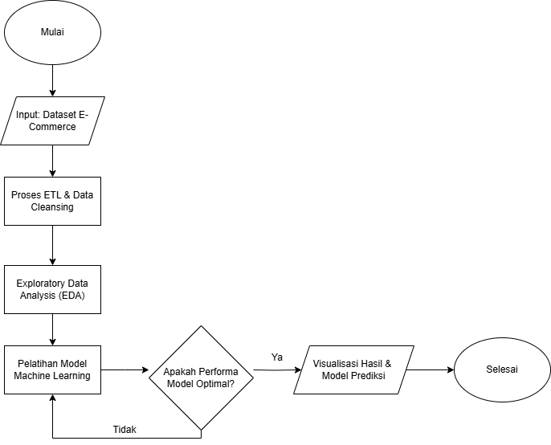
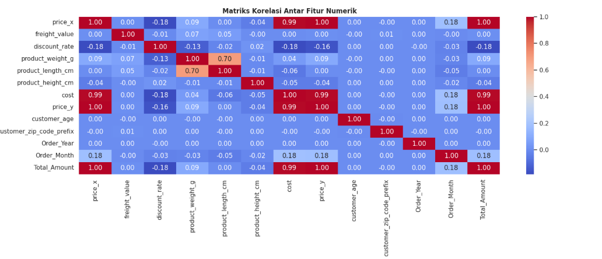
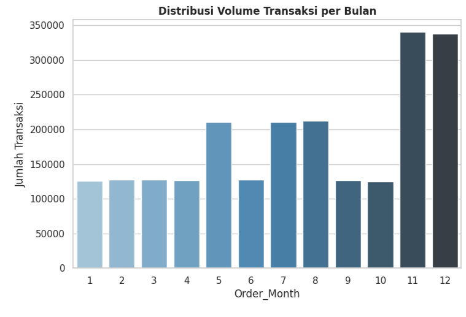
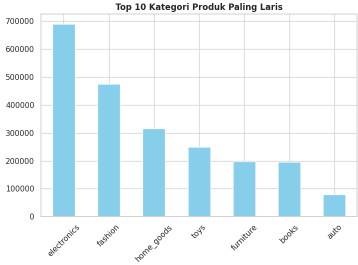
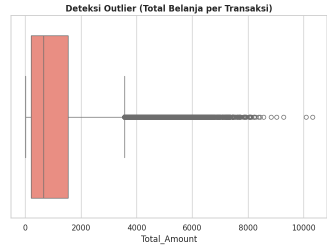
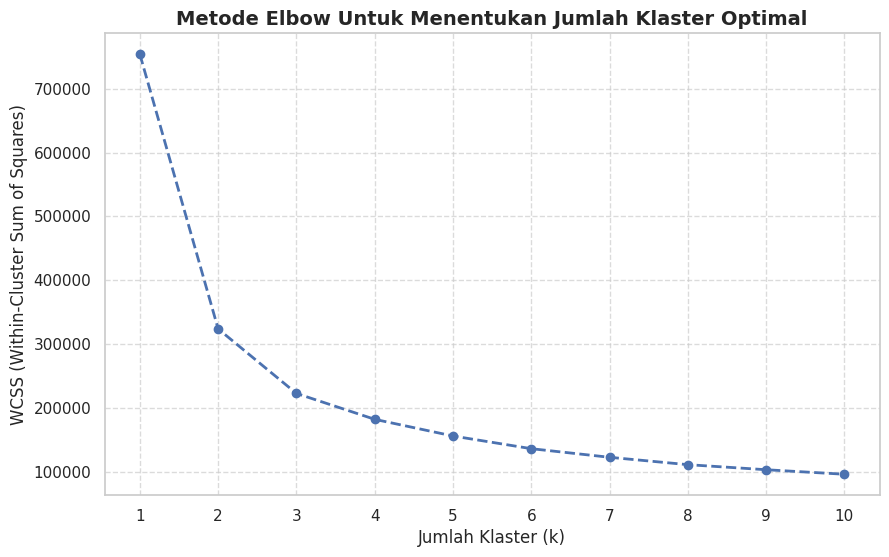

# 🛒 Laporan Big Data Segmentasi Pelanggan E-Commerce Menggunakan Algoritma K-Means Clustering

**UAS Big Data - Kelas A**
* Ahmad Zayn Usman (2310511001)
* Fandi Yakub (2310511005)
* Fauzio Yunus Alim (2310511020)

---

## 📄 Abstrak
Pertumbuhan pesat industri e-commerce telah menghasilkan lonjakan volume data transaksi harian yang sangat masif. Kumpulan data berskala besar ini mengakibatkan sistem manajemen basis data konvensional kesulitan untuk memproses dan mengekstraksi wawasan berharga secara efisien. Tanpa adanya arsitektur analitik yang memadai, perusahaan kehilangan kemampuan untuk mendeteksi anomali, meramalkan tren, serta mencegah perpindahan pelanggan (churn). Sebagai solusi dari fenomena tersebut, proyek ini mengimplementasikan alur pemrosesan analitik Big Data menggunakan *Synthetic U.S. E-Commerce Dataset* yang berisi jutaan baris data transaksi. Tahapan dimulai dari ekstraksi, transformasi memori skala besar (downcasting), hingga pemodelan *Machine Learning* tanpa pengawasan (*Unsupervised Learning*).

Hasil pembersihan data menghasilkan 2.199.819 baris transaksi siap latih dengan integritas tinggi (tanpa duplikasi). Analisis deskriptif menemukan dominasi penjualan pada kategori barang elektronik dan lonjakan aktivitas belanja pada akhir tahun. Melalui pemodelan K-Means Clustering, pelanggan berhasil disegmentasi ke dalam 4 klaster optimal berdasarkan total pembelanjaan, kuantitas barang, dan frekuensi transaksi. Keempat segmen tersebut adalah Pelanggan VIP, Loyal, Reguler, dan Pasif. Pemetaan profil ini memberikan rekomendasi strategis dan aplikatif bagi platform untuk mempertahankan retensi pelanggan VIP serta mendistribusikan promosi terarah guna mencegah pelanggan pasif meninggalkan platform.

---

## ⚙️ Metode (Pipeline Big Data)

Tahapan eksperimen dan pemrosesan dalam arsitektur Big Data ini dijalankan menggunakan komputasi awan Google Colab yang diintegrasikan dengan Google Drive.
1. **Extract:** Penarikan 1 juta baris *Synthetic U.S. E-Commerce Dataset* secara otomatis menggunakan Kaggle API.
2. **Transform (Data Cleansing & Engineering):** Penanganan nilai kosong (*missing values*), eliminasi data ganda, rekayasa fitur waktu dan finansial, serta *downcasting* tipe data untuk optimasi RAM.
3. **Load:** Pemuatan dan ekspor *DataFrame* bersih ke dalam format `.parquet` di *cloud storage*.
4. **Exploratory Data Analysis (EDA):** Pembuatan visualisasi univariat, bivariat, dan multivariat (matriks korelasi) untuk mengekstraksi pola awal data transaksi.

6. **Modeling (K-Means Clustering):** Standardisasi skala fitur numerik menggunakan `StandardScaler`, evaluasi pencarian jumlah klaster optimal melalui *Elbow Method*, dan pelatihan model sentroid K-Means.

---

## 📊 Hasil Analisis

### 1. Data Quality
* **Integritas Tinggi:** Tidak ditemukan adanya baris transaksi yang ganda (0 baris duplikat).
* **Missing Values Logis:** Terdapat 6,62% data kosong pada kolom `order_delivered_carrier_date` dan `order_delivered_customer_date`. Hal ini logis dan merepresentasikan pesanan yang belum dikirim atau dibatalkan. Baris data ini tidak dibuang karena fitur logistik tersebut tidak digunakan sebagai variabel pembentuk klaster.
* **Dimensi Akhir:** Dataset siap latih dan analisis berjumlah 2.199.819 baris transaksi.

### 2. Data Descriptive
* **Tren Waktu:** Terjadi lonjakan pesanan yang sangat signifikan (menembus 300.000 transaksi) pada bulan ke-11 (November) dan ke-12 (Desember), mengindikasikan tingginya interaksi saat kampanye diskon liburan akhir tahun (*holiday season*).

* **Kategori Produk Dominan:** Tiga komoditas dengan volume penjualan tertinggi secara berturut-turut adalah *electronics* (~700.000 penjualan), *fashion*, dan *home goods*.

### 3. Diagnostic & Predictive Modeling
* **Deteksi Pencilan (Outlier):** Distribusi nominal belanja mayoritas berada di bawah 4.000 USD, namun terdapat transaksi bernilai ekstrem menembus 10.000 USD (indikasi pembelian barang *high-end*). Pencilan ekstrem ini dieliminasi batas batas kuartilnya sebelum pemodelan agar sentroid tidak bergeser secara bias.

* **Evaluasi Model:** Patahan kurva *Elbow Method* melandai drastis pada titik $k=4$, sehingga jumlah klaster optimal ditetapkan 4. Validasi kinerja model K-Means ($k=4$) mencatatkan separasi yang memadai dengan *Silhouette Score* sebesar 0.3389 dan *Davies-Bouldin Index* di angka 1.0496.

---

## 💡 Insight & Tindak Lanjut Bisnis (Actionable Strategy)
Dari hasil diagnosis pusat klaster (*centroid*), model memetakan pelanggan ke dalam 4 segmen spesifik. Berikut adalah karakteristik dan rekomendasi tindakan strategis (*actionable*) berbasis data:

* 👑 **Klaster 1: Pelanggan VIP / Sultan**
  * **Pola:** Daya beli sangat tinggi (rata-rata 6.677,62 USD), membeli kuantitas barang paling banyak (15,92 barang), dan frekuensi transaksi sangat sering (7,04 kali).
  * **Tindak Lanjut Bisnis:** Tingkatkan kualitas layanan eksklusif. Berikan akses prioritas pembelian (*early access*) untuk peluncuran barang elektronik kelas atas (*high-end*) terbaru dan layanan dukungan pelanggan khusus tanpa antre guna memastikan loyalitas absolut mereka tetap terjaga.

* 🤝 **Klaster 2: Pelanggan Loyal / Setia**
  * **Pola:** Menjadi mesin penggerak volume operasional utama dengan konsistensi belanja di angka 5.019,63 USD dan frekuensi kedatangan 4,75 kali.
  * **Tindak Lanjut Bisnis:** Implementasikan strategi *Cross-Selling*. Rekomendasikan produk-produk komplementer (seperti aksesori tambahan untuk kategori *electronics* atau *fashion*) dengan harga *bundling* khusus untuk sedikit demi sedikit meningkatkan total keranjang belanja mereka.

* 🛒 **Klaster 0: Pelanggan Reguler / Menengah**
  * **Pola:** Kelompok konsumen mayoritas dengan intensitas dan nominal belanja rata-rata yang wajar (2.857,33 USD).
  * **Tindak Lanjut Bisnis:** Percepat frekuensi transaksi mereka dari sekadar reguler menjadi loyal dengan mendistribusikan kupon *cashback* bersyarat atau program loyalitas (poin). Berikan *rewards* ketika mereka berhasil mencapai batas belanja (target minimal pembelian) tertentu setiap bulannya.

* ⚠️ **Klaster 3: Pelanggan Pasif / Risiko Churn**
  * **Pola:** Pengeluaran finansial sangat rendah (1.337,80 USD) dan paling jarang mengunjungi platform (hanya 1,73 kali).
  * **Tindak Lanjut Bisnis:** Eksekusi kampanye mitigasi *churn* (pencegahan pelanggan kabur). Kirimkan kampanye pemasaran ulang (*retargeting*), seperti notifikasi *Push* atau Email *newsletter* yang berisi tawaran diskon retensi besar besaran ("Kami Merindukan Anda") untuk menarik mereka kembali ke platform.

---

## 🎯 Kesimpulan
Eksperimen arsitektur analitik ini membuktikan bahwa pemrosesan *Big Data* berskala masif dapat ditangani secara efisien melalui integrasi lingkungan Google Colab, *cloud storage*, dan teknik optimasi memori. Platform ini memiliki basis operasional yang kuat pada komoditas elektronik dengan perputaran transaksi yang memuncak pada periode liburan akhir tahun. Melalui pendekatan algoritma K-Means Clustering dengan pengukuran $k=4$, platform kini memiliki visibilitas *data-driven* untuk mengidentifikasi 4 profil konsumen mulai dari Pelanggan VIP hingga Pasif. Hasil segmentasi ini memungkinkan pihak manajemen untuk tidak sekadar menebak tren pasar, melainkan secara presisi mengalokasikan anggaran pemasaran secara efektif—yakni memprioritaskan layanan untuk pelanggan paling menguntungkan (VIP) sembari mencegah kerugian finansial akibat ditinggalkan oleh kelompok pelanggan pasif (*churn*).
